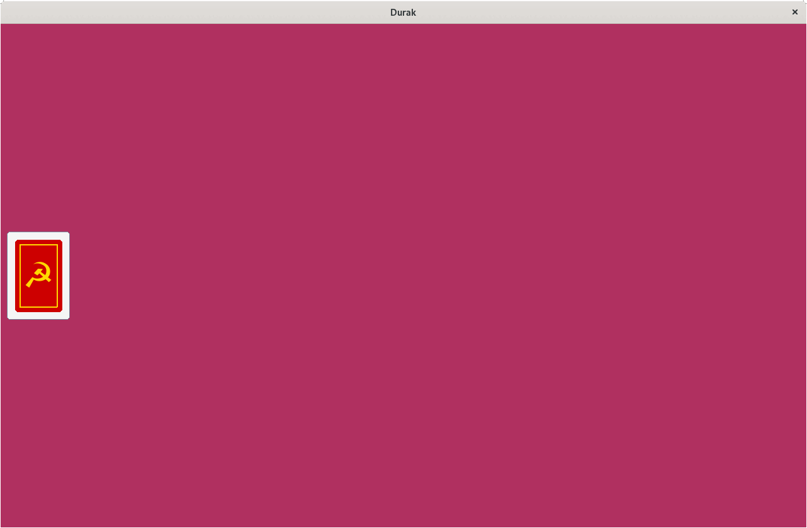

[](https://github.com/psf/black)

# Durak pygame GUI

Dummy [Durak](https://en.wikipedia.org/wiki/Durak) GUI implemented in [python](https://www.python.org/) using [pygame](https://www.pygame.org/) with no functionality.



## Installation

```bash
pip install --user git+https://github.com/ptrstn/durak-pygame
```

## Usage

```bash
durakgui
```
